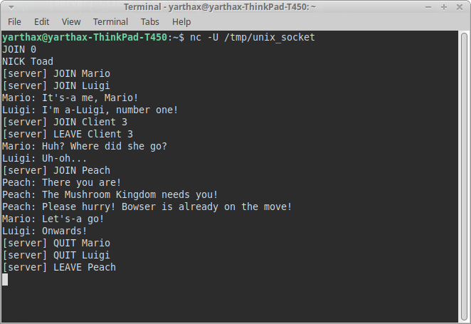
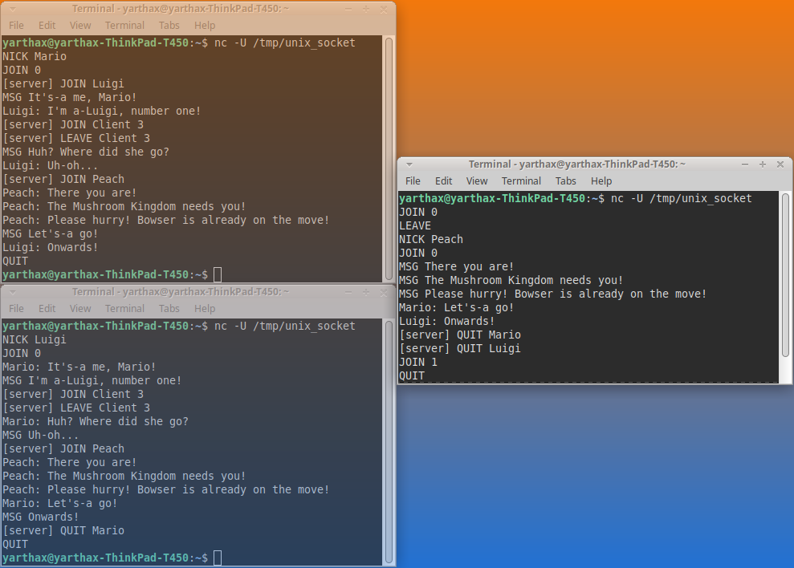

## Manual Multi-Client Testing (v0.1.x)

This document records manual, interactive tests performed using
multiple concurrent UNIX domain socket clients.

The goal is to validate protocol semantics, execution ordering,
and broadcast scope under real event-driven conditions.

### Test Environment
* Server: unix-chat-server v0.1.x
* Model: single-process, single-threaded, select()-driven
* Clients: multiple terminal-based socket clients

### Scenario: Multi-Client room interaction

**Figure 1 – Server protocol execution.**
Event-driven `select()` loop processing multiple clients, emitting JOIN/LEAVE/QUIT events.

**Figure 2 – Spectator client (Toad).**
Protocol view from a passive client, observing server events and user messages.

**Figure 3 – Active clients (Mario, Luigi and Peach).**
Demonstrates concurrent message emission by multiple clients in the same room.

This scenario validates:

* JOIN visibility to existing room members
* Correct broadcast ordering across multiple clients
* Distinction between LEAVE and QUIT events
* Late nickname assignment behavior
* Messages are delivered only to clients in the same room, as demonstrated by concurrent messaging among multiple clients within a single room (Figure 3).

Confirmed invariants:

* JOIN events are broadcast only after room membership mutation
* LEAVE events are broadcast before room removal
* QUIT triggers LEAVE-like semantics but terminates the connection
* Messages are delivered only to clients in the same room
* Grammar violations result in immediate disconnect

#### Edge Cases
All grammar-defined error cases (invalid commands, missing arguments,
overlong lines, malformed input) were manually tested and correctly
resulted in immediate disconnection, as per protocol rules.
